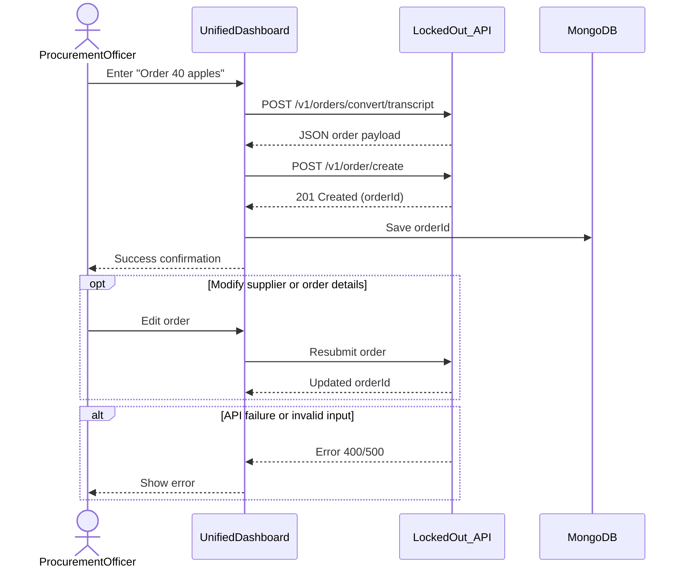

# Use Case 1: Inbound Restocking (Smart Procurement)

This use case covers the scenario where the Procurement Officer detects low inventory and places a restocking order using the Unified Dashboard. The dashboard converts natural language input into a structured order via the LockedOut API, creates the order, and saves it internally. Optional flows include modifying the order before submission, and exceptional flows handle API errors or invalid inputs.

