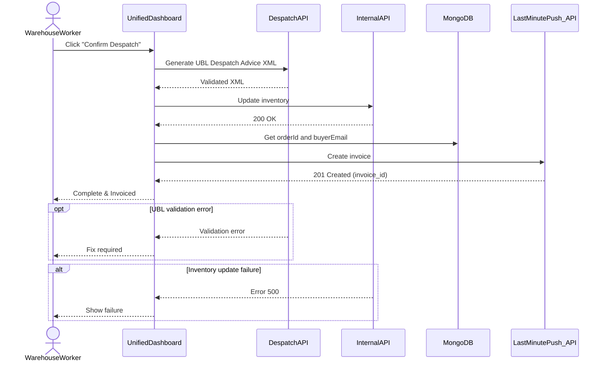

# Use Case 2: Outbound Despatch, UBL Generation & Automated Invoicing

In this use case, a Warehouse Worker confirms despatch of packed goods via the Unified Dashboard. The dashboard generates a UBL-compliant Despatch Advice XML, updates inventory in real time, and automatically calls the Last Minute Push API to generate an invoice. Optional flows include UBL validation errors that require user correction, and exceptional flows handle inventory update failures.

