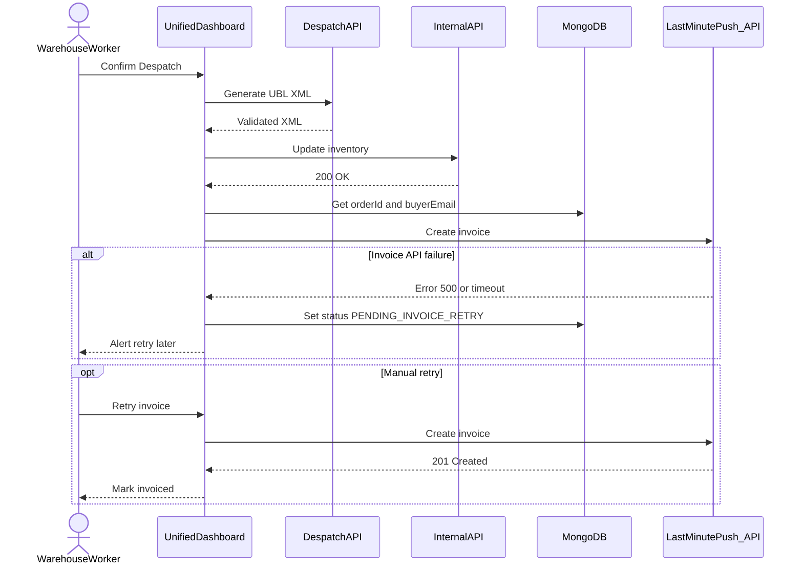

# Use Case 3: Exception Flow – Invoice Generation Failure
 
This use case covers the exceptional scenario where, after despatch confirmation, the Last Minute Push API fails or times out during invoice creation. The Unified Dashboard keeps inventory deduction unchanged and flags the order as PENDING_INVOICE_RETRY. Optional flows allow a Warehouse Worker or Finance Clerk to manually retry invoice creation.

